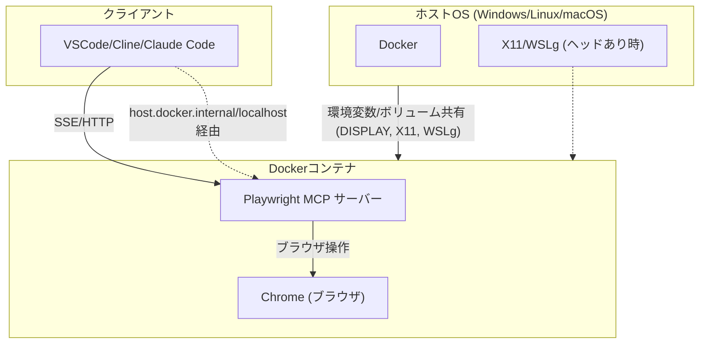

# Playwright MCP Docker 環境

このプロジェクトは、`@playwright/mcp` サーバーを実行するための Docker Compose 環境を提供します。Cline や Cursor、VSCode などのクライアントから Playwright MCP サーバーを簡単にセットアップ・管理できます。

参考：https://github.com/iuill/playwright-mcp-docker

## システム構成図



## 前提条件

- Docker
- Docker Compose

## セットアップ

1. **リポジトリをクローン:**
   ```bash
   git clone <repository-url>
   cd playwright-mcp-docker
   ```
2. **`.env` ファイルを作成:**
   サンプル環境ファイルをコピーします:
   ```bash
   cp .env.sample .env
   ```
3. **`.env` を設定:**
   `.env` ファイルを編集して、お使いの環境や好みに合わせて設定を調整します:
   - `MCP_HOST_PORT`: MCP サーバーがホストマシンからアクセス可能になるポート (デフォルト: `9222`)。
   - `HEADLESS`: ヘッドレスモード (ブラウザ GUI なし) の場合は `true`、ヘッドありモード (GUI セットアップが必要) の場合は `false` に設定します。デフォルトは `true` です。
   - **(ヘッドありモードのみ)** `DISPLAY`, `WAYLAND_DISPLAY`, `XDG_RUNTIME_DIR`: Linux 環境 (特に WSLg) で GUI アプリケーションに必要な環境変数。デフォルト値が提供されています。
   - **(ヘッドありモードのみ)** `X11_HOST_PATH`, `WSLG_HOST_PATH`: X11 および WSLg のソケット/ディレクトリのホストパス。デフォルト値が提供されています。システム構成が異なる場合は調整してください。Windows Docker から WSL パスにアクセスする場合は、`\\wsl.localhost\DistroName\...` 形式を使用します (`.env.sample` を参照)。

## サーバーの起動・停止

### サーバーの起動

```bash
docker-compose up --build -d
```

- `--build` フラグは初回または `Dockerfile` が変更された場合にのみ必要です。
- `-d` フラグはコンテナをデタッチモード (バックグラウンド) で実行します。

### サーバーの停止

```bash
docker-compose down
```

## クライアントの設定

### Claude Code での MCP サーバー追加例

- `<MCP_HOST_PORT>` は `.env` ファイルの値に置き換えてください（例: 9222）。
- `playwright` は任意のサーバー名に変更可能です。
- `host.docker.internal` は、Docker コンテナ内の MCP サーバーにホストからアクセスするためのアドレスです。

```bash
claude mcp add --transport sse playwright http://host.docker.internal:9222/sse
```

### MCP クライアントを設定 (例: VSCode/Cline)

- `playwright_sse` (または任意の名前に変更可能) という名前の MCP サーバーを追加または有効化します。
- 接続タイプを **SSE** に設定します。
- URL を `http://localhost:<MCP_HOST_PORT>/sse` に設定します (`<MCP_HOST_PORT>` を `.env` ファイルの値に置き換えます。例: `http://localhost:9222/sse`)。
- クライアント側の設定例 (設定ファイル名はクライアントによります):

```json
{
  "mcpServers": {
    "playwright": {
      "url": "http://localhost:9222/sse"
    }
  }
}
```

## 設定の詳細

- **`.env` ファイル:** ポート、ヘッドレスモード、ヘッドありモード用のパスなど、環境固有の設定を管理します。
- **`docker-compose.yml`:** Docker サービスを定義し、`.env` から変数を読み込み、ポートマッピングとボリュームを設定します。
- **`Dockerfile`:** Docker イメージを定義し、`@playwright/mcp` とその依存関係 (Chrome を含む) をインストールします。
- **`entrypoint.sh`:** コンテナ起動時に実行されるスクリプトで、`HEADLESS` 環境変数に基づいて `npx @playwright/mcp` コマンドに適切な引数 (`--headless` または `--port`) を渡します。

## モードの切り替え

- **ヘッドレスモード:** `.env` で `HEADLESS=true` に設定します。コンテナを再起動します: `docker-compose up -d`。
- **ヘッドありモード:** `.env` で `HEADLESS=false` に設定します。ホスト環境 (例: WSLg または X Server) が正しくセットアップされていることを確認してください。コンテナを再起動します: `docker-compose up -d`。

### ヘッドありモードに関する注意 (WSLg)

- Windows で WSLg を使用している場合、`docker-compose.yml` のデフォルト設定と `.env.sample` の WSL2 固有のパスは通常機能します。`.env` 内のパスが、お使いの WSL ディストリビューション名 (Ubuntu でない場合) と一致していることを確認してください。
- WSLg を使用していない場合 (例: 標準的な Linux デスクトップ、または別の X Server を使用する macOS/Windows)、`.env` ファイル内の `DISPLAY` 変数と、場合によってはボリュームマウント (`X11_HOST_PATH`) を X Server のセットアップに合わせて調整する必要があります。
