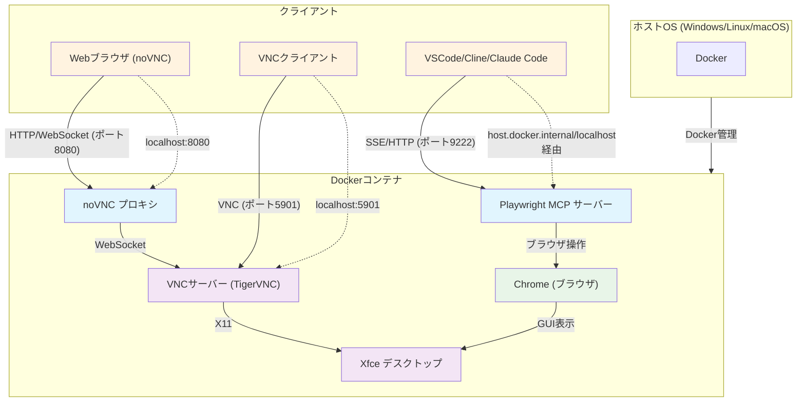

# Playwright MCP Docker 環境

このプロジェクトは、`@playwright/mcp` サーバーを実行するための Docker Compose 環境を提供します。Cline や Cursor、VSCode などのクライアントから Playwright MCP サーバーを簡単にセットアップ・管理できます。

参考：https://github.com/iuill/playwright-mcp-docker

## 目次

1. [システム構成](#システム構成)
2. [前提条件](#前提条件)
3. [セットアップ](#セットアップ)
4. [設定](#設定)
5. [サーバー管理](#サーバー管理)
6. [アクセス方法](#アクセス方法)
7. [クライアント設定](#クライアント設定)
8. [技術詳細](#技術詳細)
9. [利点](#利点)

## システム構成

### システム構成図



### ポート構成

| ポート | サービス       | 用途                 | アクセス方法       |
| ------ | -------------- | -------------------- | ------------------ |
| 9222   | MCP サーバー   | SSE/HTTP 接続        | クライアントアプリ |
| 5901   | VNC サーバー   | 直接 VNC 接続        | VNC クライアント   |
| 8080   | noVNC プロキシ | Web ブラウザアクセス | Web ブラウザ       |

## 前提条件

- Docker
- Docker Compose

## セットアップ

### 1. リポジトリのクローン

```bash
git clone <repository-url>
cd playwright-mcp-docker
```

### 2. 環境設定ファイルの作成

#### 方法 1: .env.sample からコピー (推奨)

```bash
cp .env.sample .env
```

#### 方法 2: 手動で作成

以下の内容で`.env`ファイルを作成してください:

```bash
# MCP Server Configuration
# MCPサーバーのポート設定
MCP_HOST_PORT=9222

# VNC Authentication
# VNC password (used for both VNC client and noVNC web interface)
VNC_PASSWORD=browser-use

# VNC Server Configuration
# VNCサーバーの詳細設定
VNC_DISPLAY=:1
VNC_PORT=5901
VNC_GEOMETRY=1920x1080
VNC_DEPTH=24

# noVNC Configuration
# noVNCプロキシの設定
NOVNC_PORT=8080
```

## 設定

### 基本設定

| 設定項目        | デフォルト値  | 説明                                                 |
| --------------- | ------------- | ---------------------------------------------------- |
| `MCP_HOST_PORT` | `9222`        | MCP サーバーのポート番号                             |
| `VNC_PASSWORD`  | `browser-use` | VNC 認証パスワード (VNC クライアントと noVNC で共通) |
| `VNC_PORT`      | `5901`        | VNC サーバーのポート番号                             |

### 高度な設定

| 設定項目       | デフォルト値 | 説明                   |
| -------------- | ------------ | ---------------------- |
| `VNC_DISPLAY`  | `:1`         | VNC ディスプレイ番号   |
| `VNC_GEOMETRY` | `1920x1080`  | 画面解像度             |
| `VNC_DEPTH`    | `24`         | 色深度                 |
| `NOVNC_PORT`   | `8080`       | noVNC プロキシのポート |

## サーバー管理

### サーバーの起動

```bash
docker-compose up --build -d
```

- `--build` フラグは初回または `Dockerfile` が変更された場合にのみ必要です。
- `-d` フラグはコンテナをデタッチモード (バックグラウンド) で実行します。

### サーバーの停止

```bash
docker-compose down
```

### ログの確認

```bash
docker-compose logs -f
```

## アクセス方法

### 1. noVNC Web インターフェース (推奨)

- **URL**: `http://localhost:8080/vnc.html`
- **パスワード**: `browser-use` (VNC_PASSWORD と同じ)
- **特徴**: Web ブラウザから直接アクセス可能

### 2. VNC クライアント

- **ホスト**: `localhost`
- **ポート**: `5901`
- **パスワード**: `browser-use` (VNC_PASSWORD と同じ)
- **特徴**: 専用 VNC クライアントが必要

## クライアント設定

### Claude Code での設定

```bash
claude mcp add --transport sse playwright http://host.docker.internal:9222/sse
```

### VSCode/Cline での設定

```json
{
  "mcpServers": {
    "playwright": {
      "url": "http://localhost:9222/sse"
    }
  }
}
```

### 設定の説明

- `<MCP_HOST_PORT>` は `.env` ファイルの値に置き換えてください（例: 9222）
- `playwright` は任意のサーバー名に変更可能です
- `host.docker.internal` は、Docker コンテナ内の MCP サーバーにホストからアクセスするためのアドレスです

## 技術詳細

### ファイル構成

| ファイル             | 役割                                                                                                 |
| -------------------- | ---------------------------------------------------------------------------------------------------- |
| `.env`               | 環境固有の設定を管理                                                                                 |
| `docker-compose.yml` | Docker サービスを定義し、`.env` から変数を読み込み、ポートマッピングとボリュームを設定               |
| `Dockerfile`         | Docker イメージを定義し、`@playwright/mcp`、VNC サーバー、noVNC プロキシとその依存関係をインストール |
| `entrypoint.sh`      | コンテナ起動時に実行されるスクリプトで、VNC サーバー、noVNC プロキシ、Playwright MCP サーバーを起動  |

### サービス構成

| サービス       | 役割                            | ポート |
| -------------- | ------------------------------- | ------ |
| Playwright MCP | AI エージェントがブラウザを制御 | 9222   |
| TigerVNC       | VNC サーバー                    | 5901   |
| noVNC          | Web ブラウザ用 VNC プロキシ     | 8080   |

## 利点

### noVNC 対応の利点

1. **視覚的確認**: ブラウザの動作をリアルタイムで確認可能
2. **Web ブラウザアクセス**: 専用クライアント不要で Web ブラウザからアクセス
3. **クロスプラットフォーム**: どの OS でも同じ方法でアクセス
4. **シンプルな構成**: ホスト環境の X11/WSLg 設定が不要
5. **セキュリティ**: VNC パスワードによる認証

### 従来方式との比較

| 項目                   | 従来方式            | noVNC 方式   |
| ---------------------- | ------------------- | ------------ |
| ホスト設定             | X11/WSLg 設定が必要 | 不要         |
| アクセス方法           | 専用クライアント    | Web ブラウザ |
| クロスプラットフォーム | 制限あり            | 完全対応     |
| セットアップ           | 複雑                | シンプル     |
